# Big Data Pipeline for Zomato Delivery Operations Analytics

**Course:** Big Data Processing

**Team 3:**

- Angela Melia Gunawan / 0706022310023
- Rayna Shera Chang / 0706022310022
- Anne Tantan / 0706022310043
- Jacqlyn Chen / 0706022310042
- Sharon Tan / 0706022310024

---

## Architecture Diagram

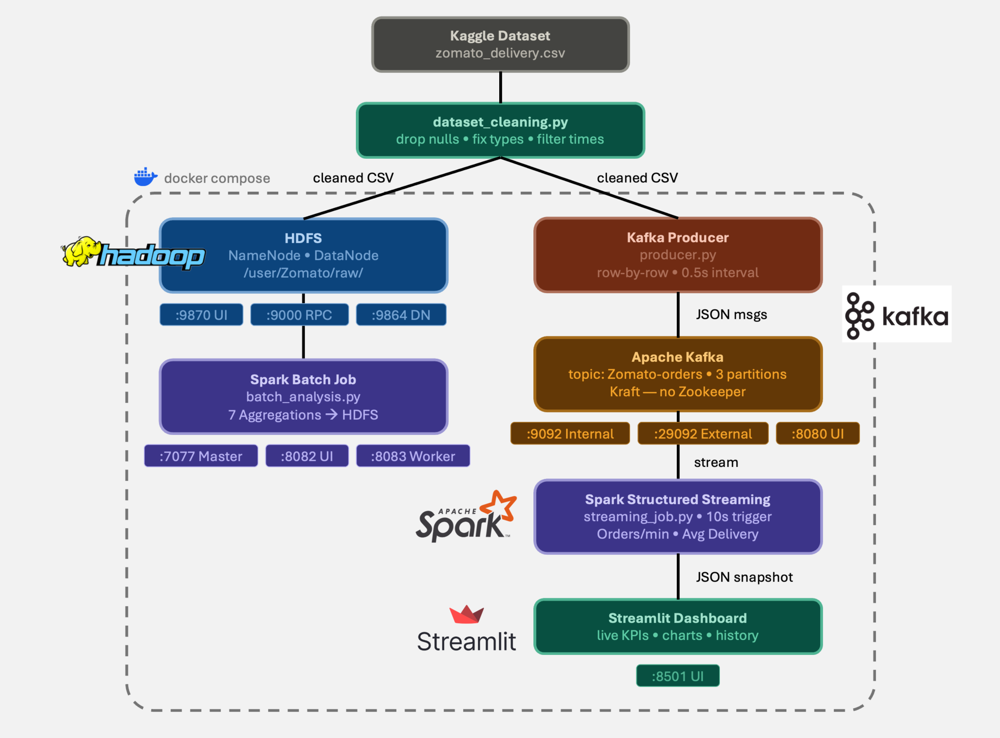

---

## Overview

This project focuses on the design and development of a **working big data pipeline** using tools such as distributed storage, batch processing, stream ingestion, stream processing, and live visualization. The goal is to create an end-to-end system that demonstrates how large-scale data can be processed and analyzed in a real-world scenario.

In this project, the chosen dataset is **Zomato Delivery Operations Analytics**, which focuses on food delivery performance and operational efficiency. The pipeline processes delivery data to support both historical analysis and real-time monitoring, enabling insights into delivery time, rider performance, and operational conditions.

---

## Project Description

This project is developed within the **food delivery domain**, specifically analyzing operational performance in a Zomato-like delivery system. The system is designed to process delivery data such as order timing, weather conditions, traffic density, order type, vehicle type, and delivery personnel ratings to understand factors affecting delivery efficiency.

An end-to-end big data pipeline is built starting from data ingestion, followed by storage in a distributed system, then processing through both batch and streaming layers. Batch processing is used to analyze historical delivery patterns such as average delivery time under different conditions, while stream processing handles real-time order events to monitor live metrics like incoming order rates and delivery performance. The results are then visualized in dashboards to support operational decision-making and performance optimization.

---

## Dataset

The dataset implemented in this project is as follows:

| Dataset                                  | Size  | Rows         | Link                                                                                                 |
| ---------------------------------------- | ----- | ------------ | ---------------------------------------------------------------------------------------------------- |
| **Zomato Delivery Operations Analytics** | ~6 MB | ~45 K orders | [Kaggle](https://www.kaggle.com/datasets/saurabhbadole/zomato-delivery-operations-analytics-dataset) |

Out of 20 original columns in the dataset, only 12 columns are selected and used in this pipeline. This selection was made to focus on the most relevant variables for delivery performance analysis and to support the design of data engineering workflows.

| Key Field                 | Data Types                                               | Description                                                 |
| ------------------------- | -------------------------------------------------------- | ----------------------------------------------------------- |
| `ID`                      | String                                                   | Unique identifier for each delivery                         |
| `Delivery_person_ID`      | String                                                   | Unique identifier for each delivery person                  |
| `Delivery_person_Ratings` | Float                                                    | Ratings assigned to the delivery person                     |
| `Order_Date`              | Datetime (yyyy-mm-dd)                                    | Date of the order                                           |
| `Time_Orderd`             | Time (hh:mm:ss)                                          | Time the order was placed                                   |
| `Time_Order_picked`       | Time (hh:mm:ss)                                          | Time the order was picked up for delivery                   |
| `Weather_conditions`      | Category (Fog, Stormy, Sandstorms, Windy, Cloudy, Sunny) | Weather conditions at the time of delivery                  |
| `Road_traffic_density`    | Category (Jam, High, Medium, Low)                        | Density of road traffic during delivery                     |
| `Type_of_order`           | Category (Snack, Meal, Drinks, Buffet)                   | Type of order                                               |
| `Type_of_vehicle`         | Category (motorcycle, scooter, electric_scooter)         | Type of vehicle used for delivery                           |
| `Festival`                | Category (Yes, No)                                       | Indicator of whether the delivery coincided with a festival |
| `Time_taken (min)`        | Integer                                                  | Time taken for delivery in minutes                          |

The selected fields include delivery identifiers, time-related attributes, operational conditions, order characteristics, and key performance indicators. These fields serve as the foundation for generating insights such as delivery time estimation, courier performance evaluation, and the impact of external conditions on delivery efficiency.

---

## Problem Statements

Based on the dataset and the selected key fields, the following problems have been identified:

### Batch Insights

1. What are the key factors that most significantly impact average delivery time across historical orders?
2. Which delivery personnel have the highest and lowest performance based on ratings and delivery time trends?
3. How does delivery time vary across different types of orders (food categories) and vehicle types?
4. What is the average delivery delay under different road traffic density levels?
5. How do festival days affect overall delivery performance compared to normal days?
6. Which combinations of weather and traffic conditions lead to the longest delivery times?
7. What is the distribution of delivery time across all historical orders, and where are the major bottlenecks?

### Real-Time Metrics

1. How many orders are being placed per minute in the system right now?
2. What is the current average delivery time of ongoing active deliveries in real time?

---

## Project Structure

```
big-data-project-class-b_team3
├── docker-compose.yml
├── hadoop_config
│   ├── .env
│   ├── core-site.xml
│   └── hdfs-site.xml
├── kafka_config
│   ├── kafka.env
│   └── server-overrides.properties
├── scripts
│   ├── init-datanode.sh
│   ├── start-hdfs.sh
│   └── dataset_cleaning.py
├── producer
│   ├── producer.py
│   └── requirements.txt
├── jobs
│   ├── batch_analysis.py
│   └── streaming_job.py
├── dashboard
│   ├── app.py
│   ├── Dockerfile
│   └── requirements.txt
├── checkpoints
│   └── .gitkeep
├── dashboard_data
│   └── .gitkeep
├── data
│   ├── zomato_delivery.csv
│   └── zomato_dataset_cleaned.csv
└── README.md
```

---

## Step-by-Step Guide

### Clone the Repository

Clone the project repository using Git:

```bash
git clone git@github.com:amgunawan/big-data-project-class-b_team3
```

---

### Download Dataset

Download from Kaggle: https://www.kaggle.com/datasets/saurabhbadole/zomato-delivery-operations-analytics-dataset

Save the CSV to the `data/` folder as `zomato_delivery.csv`.

> ⚠️ Skip this step if the file already exists in the folder.

---

### Fix Permission

Move into the folder:

```bash
cd big-data-project-class-b_team3
```

The Spark user inside the container needs write access to both of these folders.

For Linux/macOS users, run this command in the terminal:

```bash
chmod 777 checkpoints dashboard_data
```

> ⚠️ Windows users can skip this step because `chmod` permissions are not required on Windows systems.

---

### Dataset Cleaning

> ⚠️ **Must be run before uploading to HDFS.** The raw dataset contains null values, inconsistent time formats, and irrelevant columns. Cleaning produces `zomato_dataset_cleaned.csv`, which is used by the batch job and producer.

#### Install Dependencies

```bash
pip install pandas kagglehub     # for Windows users
pip3 install pandas kagglehub    # for Linux/MacOS users
```

#### Run Cleaning

```bash
cd scripts

python dataset_cleaning.py       # for Windows users
python3 dataset_cleaning.py     # for Linux/MacOS users
```

> ✅ Make sure the `zomato_dataset_cleaned.csv` file exists in `data/` before running docker compose.

---

### ⚠️ Prerequisites (Important for Windows Users)

If you are using Windows, make sure to adjust the line endings of all `.sh` and `.yml` files before running the project. Windows may automatically convert line endings to `CRLF`, which can cause errors when running Docker or shell scripts inside Linux-based containers.

To fix this issue:

1. Open the file in VS Code
2. Look at the bottom-right corner
3. If it shows `CRLF`, click it
4. Change it to `LF`
5. Save the file

> Linux/MacOS users can skip this step.

---

### Step 1 — Start all services

Go back to the project root folder:

```bash
cd big-data-project-class-b_team3
```

Make sure Docker Desktop is open and running. Let's start the services:

```bash
docker compose up --build
```

> ⚠️ If you encounter an issue, refer to this troubleshooting [section](troubleshooting.md#1-container-name-already-exists).

Wait until all containers are running. Open new terminal, then verify:

```bash
docker compose ps
```

Expected Containers:

| Container    | Port        | Description   |
| ------------ | ----------- | ------------- |
| namenode     | 9870, 9000  | HDFS NameNode |
| datanode1    | 9864        | HDFS DataNode |
| kafka        | 9092, 29092 | Kafka broker  |
| kafka-ui     | 8080        | Kafka Web UI  |
| spark-master | 7077, 8082  | Spark Master  |
| spark-worker | 8083        | Spark Worker  |
| streamlit    | 8501        | Dashboard     |

Open the Spark Master UI: http://localhost:8082

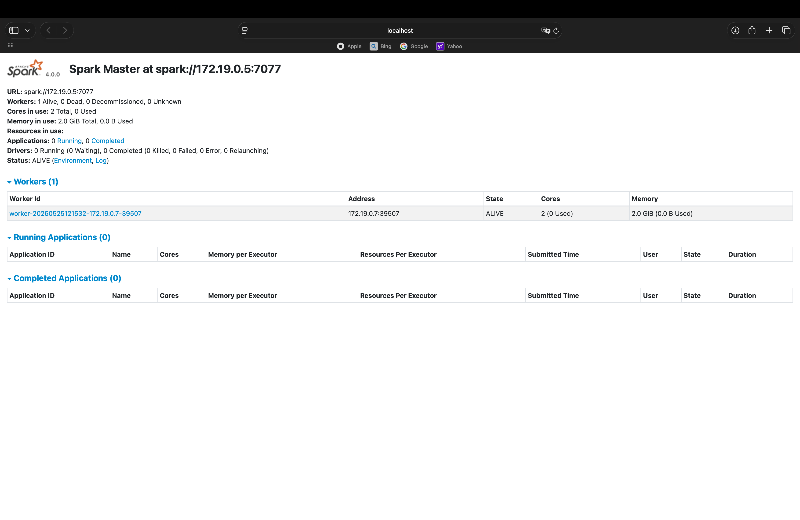

You should see **1 worker** registered with 2 cores and 2.0 GB RAM.

Open the Spark Worker UI: http://localhost:8083

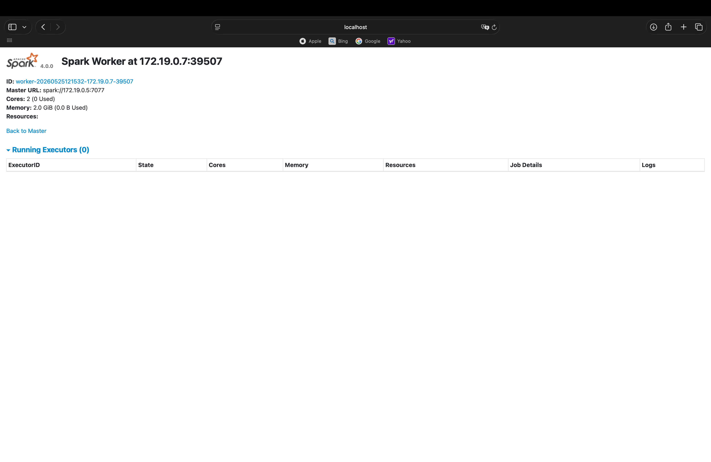

---

### Step 2 — Create Kafka Topic

Run this command in terminal:

```bash
docker exec kafka ./bin/kafka-topics.sh \
    --bootstrap-server localhost:9092 \
    --create \
    --topic zomato-orders \
    --partitions 3 \
    --replication-factor 1
```

Verify that the Kafka topic has been created successfully:

```bash
docker exec kafka ./bin/kafka-topics.sh \
    --bootstrap-server localhost:9092 \
    --list
```

---

### Step 3 — Upload Cleaned Dataset to HDFS

Use `zomato_dataset_cleaned.csv` as input for the batch job.

```bash
# Create directory in HDFS
docker exec -it namenode hdfs dfs -mkdir -p /user/zomato/raw

# Upload cleaned dataset (already mounted at /data)
docker exec -it namenode hdfs dfs -put /data/zomato_dataset_cleaned.csv /user/zomato/raw/

# Verify
docker exec -it namenode hdfs dfs -ls /user/zomato/raw/

# Preview the first lines of the CSV file
docker exec -it namenode hdfs dfs -cat /user/zomato/raw/zomato_dataset_cleaned.csv | Select-Object -First 10      # for Windows users
docker exec -it namenode hdfs dfs -cat /user/zomato/raw/zomato_dataset_cleaned.csv | head                         # for Linux/MacOS users
```

Check in browser: http://localhost:9870 → Utilities → Browse the file system

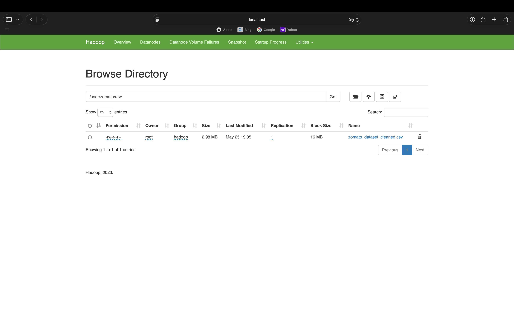

You should see that `zomato_dataset_cleaned.csv` is in `/user/zomato/raw`.

#### Fix Permission

Grants full access to `/user/zomato` in HDFS so Spark and other jobs can read/write and execute without permission issues.

```bash
docker exec -it namenode hdfs dfs -chmod -R 777 /user/zomato
```

---

### Step 4 — Submit Job A: Batch Analysis

This job reads the dataset from HDFS and runs historical aggregations across 7 problem statements, writing results back to HDFS as CSV.

```bash
docker exec -it spark-master /opt/spark/bin/spark-submit \
    --master spark://spark-master:7077 \
    --packages org.apache.spark:spark-sql-kafka-0-10_2.13:4.0.0 \
    /opt/zomato/jobs/batch_analysis.py
```

> Output: CSV directories in HDFS — `b1_*`, `b2_top/bottom_riders`, `b3_by_order`, `b3_by_vehicle`, `b4_by_traffic`, `b5_festival`, `b6_weather_traffic_combo`, `b7_distribution`, `b7_bottleneck`.

Expected Output:

1. Key Factors Impacting Avg Delivery Time

   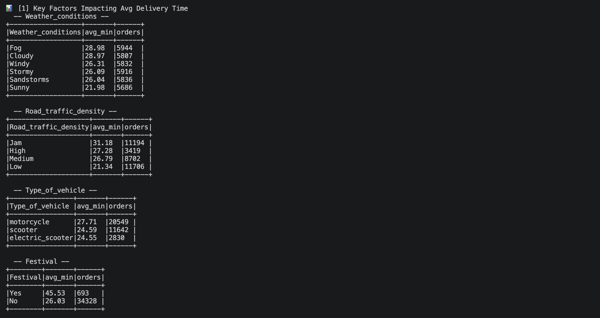

2. Rider Performance

   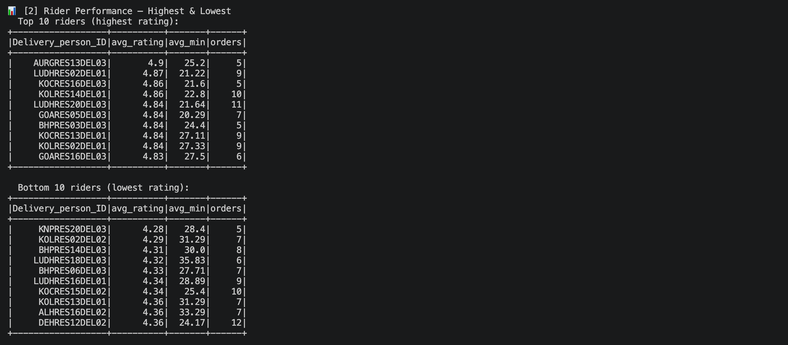

3. Delivery Time by Type of Order & Type of Vehicle

   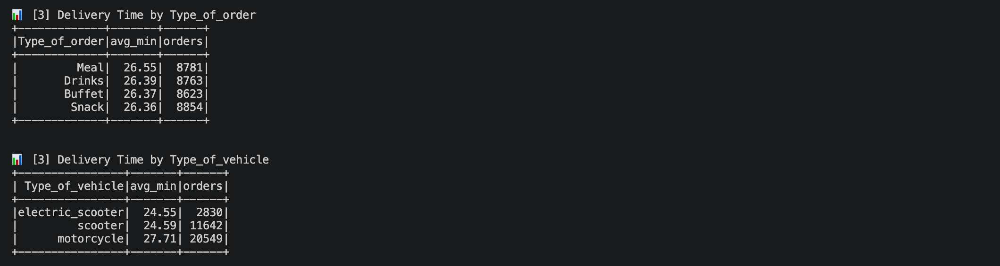

4. Avg Delivery Delay by Road Traffic Density

   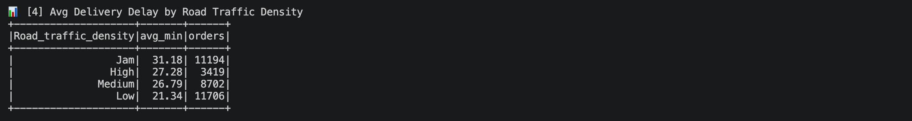

5. Festival vs Normal Day Performance

   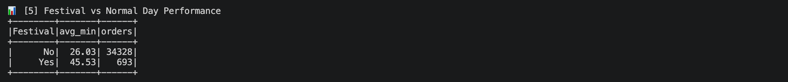

6. Weather x Traffic Worst Combinations

   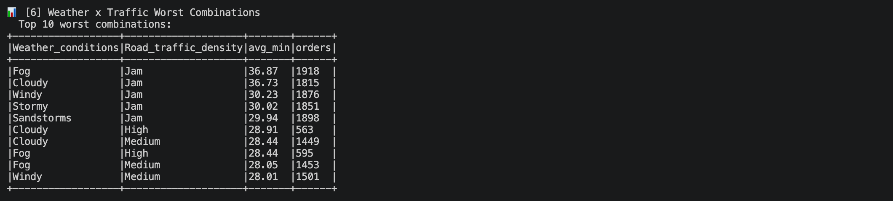

7. Delivery Time Distribution & Bottleneck

   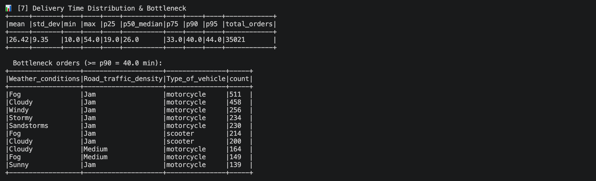

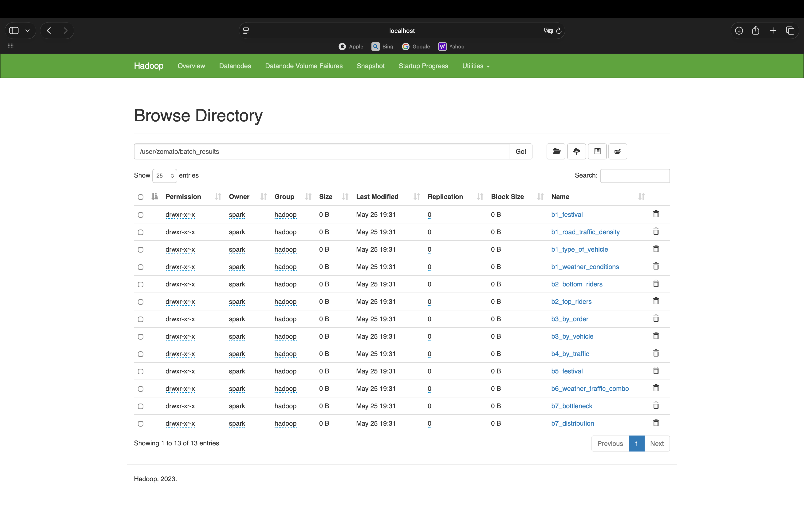

You should see all 13 `.csv` files is in `/user/zomato/batch_results`.

---

### Step 5 — Submit Job B: Spark Structured Streaming

This job consumes the live Kafka topic, aggregates delivery metrics per 10-second trigger window, and writes a JSON snapshot to disk for the dashboard to read. Keep it running in the background.

```bash
docker exec -it spark-master /opt/spark/bin/spark-submit \
    --master spark://spark-master:7077 \
    --packages org.apache.spark:spark-sql-kafka-0-10_2.13:4.0.0 \
    /opt/zomato/jobs/streaming_job.py
```

Expected Output (every micro-batch):

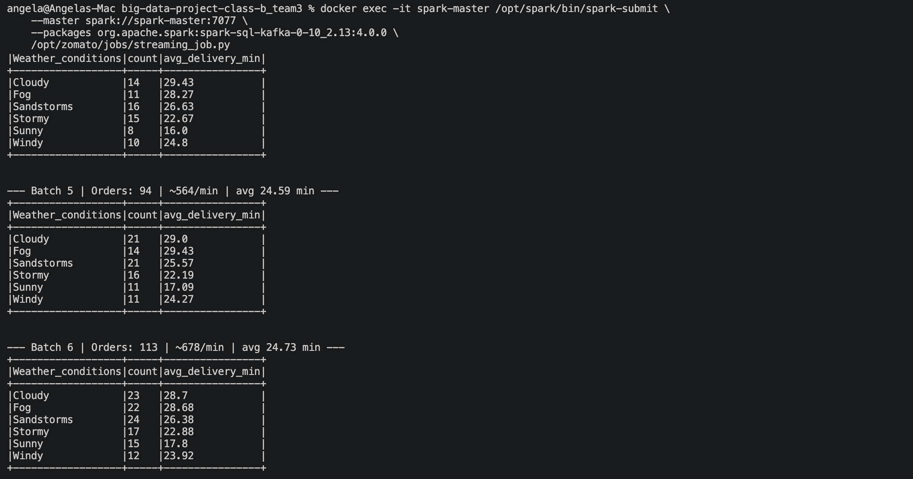

You can stop the job with `Ctrl+C` (not necessary).

---

### Step 6 — Run Producer

The producer automatically connects to `localhost:29092` (Kafka external port).

```bash
cd producer
pip install -r requirements.txt
python producer.py
```

> ⚠️ Run in the new terminal.

---

### Step 7 — Open Dashboard

| Service             | URL                   | Description            |
| ------------------- | --------------------- | ---------------------- |
| Streamlit Dashboard | http://localhost:8501 | Live Dashboard         |
| Kafka UI            | http://localhost:8080 | View incoming messages |
| Spark Master        | http://localhost:8082 | View running jobs      |
| HDFS                | http://localhost:9870 | View uploaded files    |

Expected Output:

1. Streamlit Dashboard

   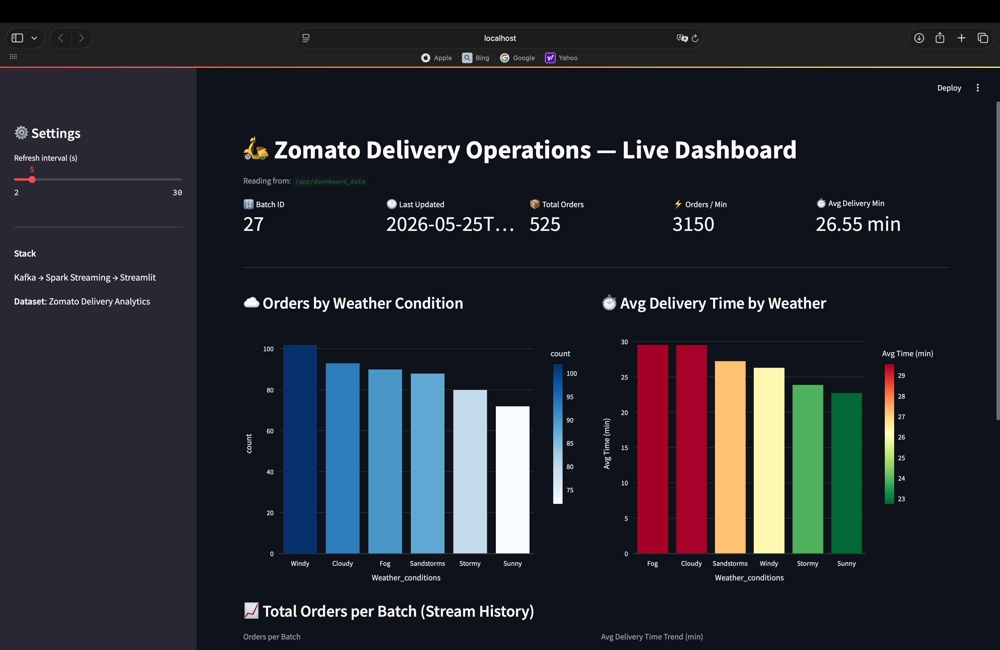

   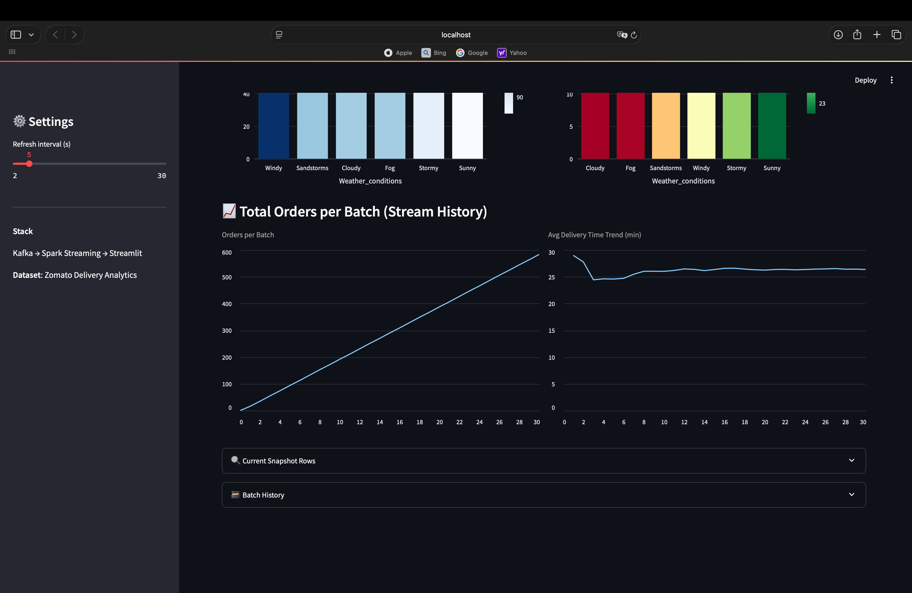

   If no snapshot exists yet you will see a warning — start Job B first (Step 5), then refresh.

   The dashboard shows:
   - `Batch ID` and `Last Updated` from the latest snapshot
   - `Total Orders` — cumulative order count across all batches
   - `Orders / Min` — estimated throughput based on the 10-second trigger window
   - `Avg Delivery Min` — rolling average delivery time across all active weather groups
   - `Orders by Weather Condition` — order volume distribution across weather condition category
   - `Avg Delivery Time by Weather` — average delivery duration per weather condition, from green (fast) to red (slow)

2. Kafka UI

   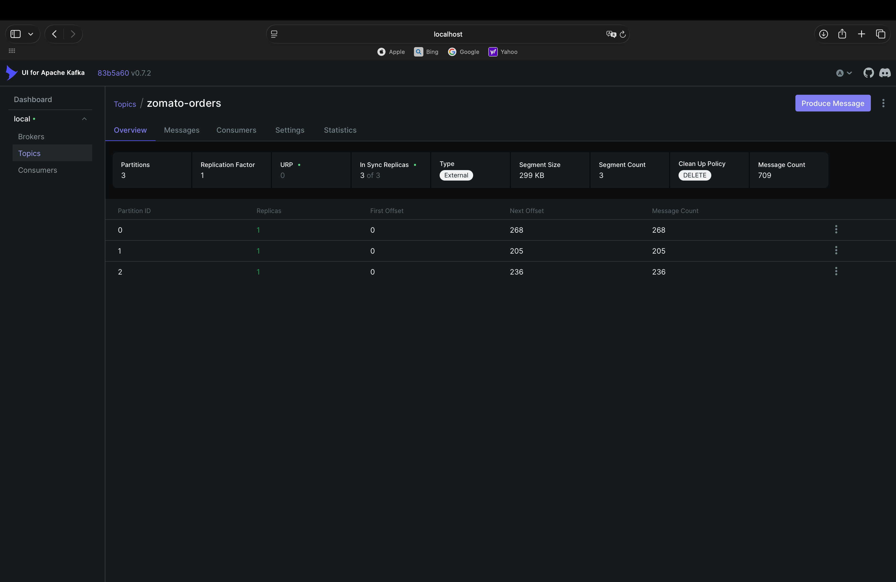

3. Spark Master

   While a job is running, the **Running Applications** tab on the Spark Master UI shows the active streaming query.

   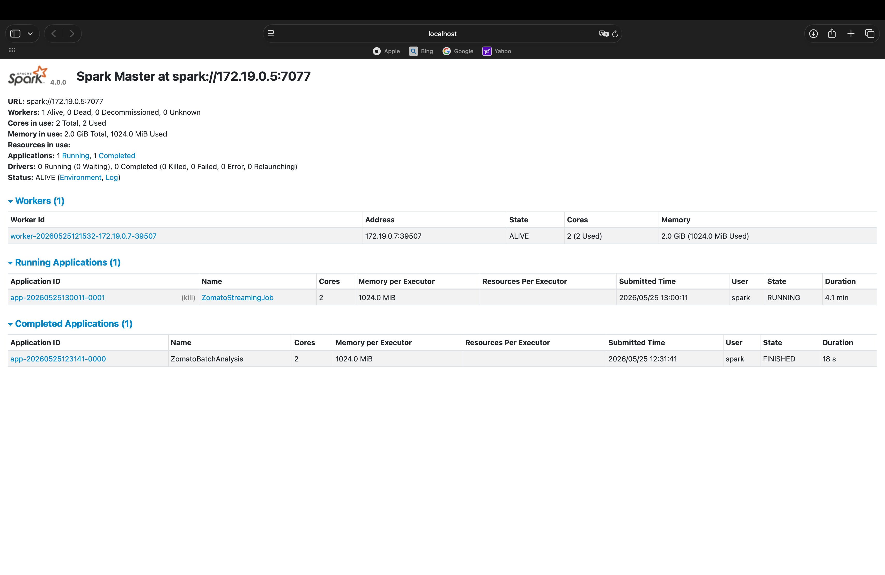

---

### Step 8 — Cleanup

```bash
# Stop all containers
docker compose down

# Delete checkpoint and dashboard data (reset for re-run)
rm -rf checkpoints/*
rm -f dashboard_data/latest_snapshot.json dashboard_data/history.jsonl
touch checkpoints/.gitkeep dashboard_data/.gitkeep

# Delete HDFS data stored in local volume
rm -rf hadoop_namenode hadoop_datanode1 hadoop_tmp
```

---

## Web UI Summary

| Service       | URL                   | Description               |
| ------------- | --------------------- | ------------------------- |
| HDFS NameNode | http://localhost:9870 | Browse files in HDFS      |
| Kafka UI      | http://localhost:8080 | Monitor topics & messages |
| Spark Master  | http://localhost:8082 | Running jobs              |
| Spark Worker  | http://localhost:8083 | Worker status             |
| Streamlit     | http://localhost:8501 | Live Dashboard            |

---

## Findings & Conclusion

### Batch Analysis

1. **Key Factors:** The factor with the strongest impact on average delivery time was `___`. Weather condition `___` and traffic density `___` consistently showed the longest delays.
2. **Rider Performance:** Top-rated riders averaged `___` min delivery time, while bottom-rated riders averaged `___` min, suggesting a correlation between rating and efficiency.
3. **Order & Vehicle Type:** `___` order type took the longest to deliver on average. `___` vehicle type was the fastest.
4. **Traffic Density:** `___` traffic density caused the most delay, averaging `___` min vs `___` min under low-traffic conditions.
5. **Festival Impact:** Deliveries during festival days were `___` min slower/faster on average compared to normal days.
6. **Worst Combinations:** The worst weather × traffic combination was `___` + `___`, averaging `___` min per delivery.
7. **Distribution:** The median delivery time was `___` min, with 90% of deliveries completed within `___` min. Bottleneck orders were concentrated under conditions: `___`.

### Real-Time Stream

1. **Orders/Min:** At peak, the stream processed approximately `___` orders per minute.
2. **Avg Delivery Time:** The live rolling average hovered around `___` min, which was `consistent with / higher than / lower than` the batch historical average.
3. Patterns observed in the stream: `___`

### Conclusion

_Example: Traffic density and weather conditions are the two strongest predictors of delivery delay. Rider rating shows a moderate correlation with speed but is likely confounded by route difficulty. Real-time monitoring validates that batch trends hold under live conditions, making this pipeline viable for operational decision-making._

---

## Known Limitations

This pipeline was built as a proof-of-concept with deliberate trade-offs under time and resource constraints. The limitations below reflect what was simplified and what we would improve given more time.

| Area            | Limitation                                                                                       | Potential Improvement                                                              |
| --------------- | ------------------------------------------------------------------------------------------------ | ---------------------------------------------------------------------------------- |
| Data            | Raw dataset has null values and inconsistent time formats that required cleaning before use      | Implement schema validation at ingestion time rather than as a pre-processing step |
| Scalability     | Single DataNode and single Spark Worker — not representative of a production cluster             | Add more DataNodes and Workers; test with a larger dataset                         |
| Fault Tolerance | No retry logic in the producer if Kafka is temporarily unavailable                               | Add exponential backoff and a dead-letter queue                                    |
| Dashboard       | Streamlit polls a JSON file on disk — a shared filesystem dependency that breaks if paths change | Replace file-based sink with a proper database (e.g. PostgreSQL or Redis)          |
| Scope           | City column was included in analysis but is sparsely populated in the dataset                    | Enrich with geolocation data or filter to cities with sufficient sample size       |

```

```
